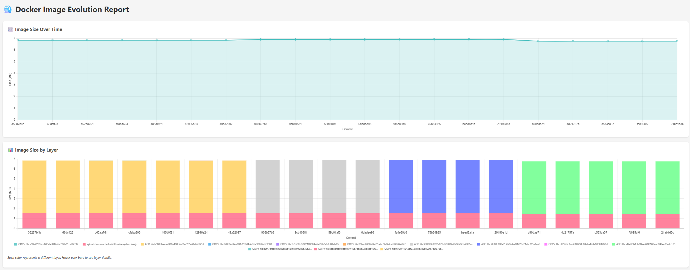
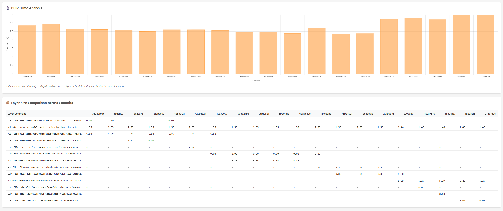

# 🐳 Docker Time Machine (DTM)

Track Docker image evolution across registry tags or git history. Find bloat, compare versions, and understand how your images changed over time.

## ⚡ Registry Analysis (No Source Required)

Analyze images directly from any container registry — no need to pull full images or have access to source code. DTM fetches only metadata (~10KB per image) for instant analysis.

```bash
# Analyze last 10 tags from Docker Hub
dtm registry nginx --last 10

# Analyze private registry
dtm registry myregistry.com/myapp --last 20

# Generate interactive HTML report
dtm registry node --last 15 --format chart

# Analyze specific tags
dtm registry mycompany/api --tags "v1.0.0,v1.1.0,v2.0.0"

# Multi-arch images
dtm registry nginx --last 5 --platform linux/amd64
```

Supports Docker Hub, Amazon ECR, Google GCR, GitHub GHCR, Azure ACR, JFrog Artifactory, and any OCI-compliant registry. Uses your existing Docker credentials (`docker login`).

## 📊 Git History Analysis

Walk through your repository's git history, build the image at each commit, and track how size changed over time. Leverages Docker's layer caching for fast builds.

```bash
# Analyze last 20 commits (default)
dtm analyze

# Generate HTML report
dtm analyze --format chart --output report.html

# Analyze specific branch
dtm analyze --branch develop --max-commits 50

# Filter by date range
dtm analyze --since 2024-01-01 --until 2024-06-30

# Skip failed builds
dtm analyze --skip-failed -v
```

## Features

- 🚀 **Registry analysis** — analyze tags without pulling images
- 📦 **Layer-by-layer comparison** — see which layers changed between versions
- 📈 **Interactive HTML charts** — visualize size trends and layer breakdown
- 🔍 **Find bloat** — automatically identifies versions with biggest size increase
- ✅ **Find optimizations** — identifies versions that reduced image size
- 📋 **Multiple formats** — table, JSON, CSV, Markdown, HTML

## Installation

```bash
git clone https://github.com/jtodic/docker-time-machine.git
cd docker-time-machine
go mod download
make build
make install
```

**Windows:** Use WSL, Git Bash, or run `go build -o dtm.exe main.go`

**Prerequisites:** Go 1.24+, Docker daemon running

## Command Reference

### Registry Analysis

```
dtm registry <image> [flags]

Flags:
  --last int          Analyze last N tags (default 10)
  --tags string       Comma-separated list of specific tags
  --platform string   Platform for multi-arch images (e.g., linux/amd64)
  -f, --format        Output format: table, json, csv, chart, markdown
  -o, --output        Output file path
  -v, --verbose       Show detailed progress
```

### Git History Analysis

```
dtm analyze [flags]

Flags:
  -r, --repo string        Path to git repository (default ".")
  -d, --dockerfile string  Path to Dockerfile (default "Dockerfile")
  -n, --max-commits int    Maximum commits to analyze (default 20, 0 = all)
  -b, --branch string      Git branch to analyze (default: current branch)
  -f, --format string      Output format: table, json, csv, chart, markdown
  -o, --output string      Output file path
      --since string       Analyze commits since date (YYYY-MM-DD)
      --until string       Analyze commits until date (YYYY-MM-DD)
      --skip-failed        Skip commits that fail to build
  -v, --verbose            Verbose output
```

## Output Examples

### Table Output

```
📊 Registry Image Analysis: nginx
==========================================
  TAG        DATE         SIZE (MB)   DIFF     LAYERS
-----------+------------+-----------+--------+---------
  1.27.3     2024-12-10   192.45     +2.1     8
  1.27.2     2024-11-15   190.35     +0.3     8
  1.27.1     2024-10-20   190.05     -1.2     8
  1.27.0     2024-09-15   191.25              8

⚠️  Biggest size increase: 1.27.3 (+2.1 MB)
✅ Biggest size reduction: 1.27.1 (-1.2 MB)
```

### HTML Chart Output

Generates an interactive report with:
- 📈 **Image size trend** — line chart showing size evolution
- 📊 **Size by layer** — stacked bar chart showing layer contributions
- 📦 **Layer comparison table** — detailed breakdown across versions





## Use Cases

### Monitoring Production Images

```bash
# Weekly size report for your production image
dtm registry mycompany/api --last 10 --format chart -o weekly-report.html
```

### Finding When Bloat Was Introduced

```bash
# Check which release caused size increase
dtm registry myapp --tags "v1.0,v1.1,v1.2,v1.3" --format table
```

### CI/CD Integration

```bash
# Export metrics as JSON for further processing
dtm registry myapp --last 5 --format json -o metrics.json
```

### Comparing Git Branches

```bash
# Analyze different branches
dtm analyze --branch main --format json -o main.json
dtm analyze --branch feature/slim --format json -o feature.json
```

## Notes

- **Registry mode** fetches metadata only — images are not pulled
- **Git mode** builds images locally — uses Docker layer cache for speed
- Results are sorted by creation date (newest first)
- Layer comparison matches by Dockerfile instruction

## License

MIT License - see [LICENSE](LICENSE) file.

## Contributing

Contributions welcome! Please open an issue or submit a pull request.
